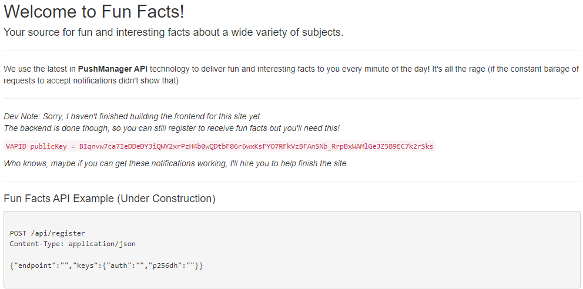
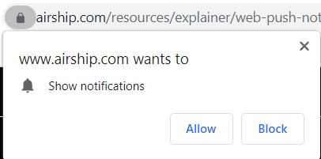
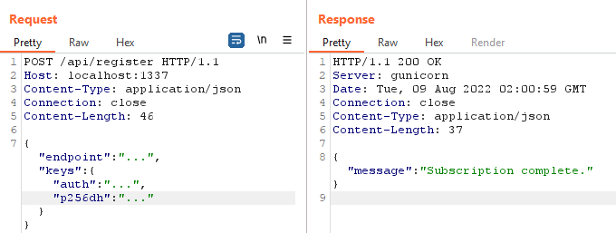
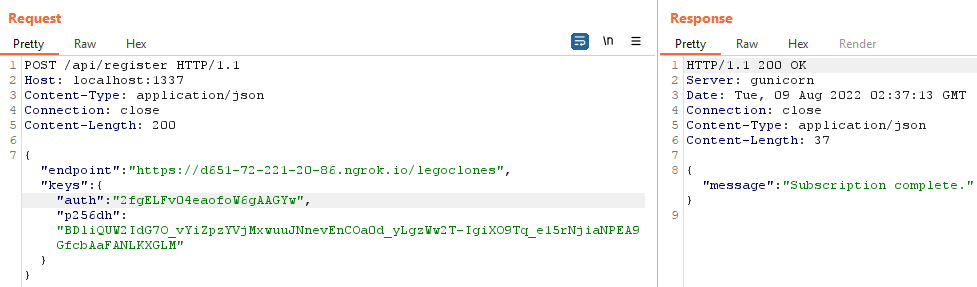

# US Cyber Games, Open CTF 2022 - Fun Facts Writeup
- Type - web
- Name - Fun Facts
- Points - 495 (13 solves)

## Description
```markdown
This site would like your permission to send you notifications. Accept or deny?

https://uscg-web-fun-facts-w7vmh474ha-uc.a.run.app

Author: Tsuto
```

## Writeup
No challenge files are provided, so all we know is what's located on the website. 



The main page, along with the challenge description, lays out the goal of the problem pretty well. You are given a public VAPID key (more on this later) and documentation for an endpoint. You need to use the VAPID key and the endpoint to subscribe yourself to notifications from this site. The last line of the main page says `Who knows, maybe if you can get these notifications working, I'll hire you to help finish the site`, which implies that the reward comes once you are subscribed to notifications.


### Understanding Push Notifications
This challenge relies less on security-specific concepts and more on an in-depth understanding of how Web Push Notifications work (*I will argue, however, that understanding something in-depth is almost a requirement for being able to hack it*). Therefore, a good portion of this writeup will be dedicated to explaining the concepts behind how we solve it. Before getting into it, a good resource is [this series of articles](https://web.dev/push-notifications-overview/) published on web.dev.

The basis of the technology is this - if websites want to send endusers pop-up notifications to give them time-sensitive information, they can use this Web Push tech for that. To sign up, a user normally navigates to the site in question. The site will say something like "Can we send you notifications?" and your browser will say something like "This site wants to send you notifications, allow or deny?" (see below). If you allow, then your browser will send popup notifications each time the site owner pushes new content.



But how can you receive notifications from a site if you don't have that site open in any tabs? Browsers accomplish this through what are called [service workers](https://developer.chrome.com/docs/workbox/service-worker-overview/). These are JavaScript-powered assets that run in the background of your browser and constantly listen for incoming information. Normally, the site developer will set up a service worker that can run in your browser and request the proper permissions from you so that you can get push notifications only from giving the site permission. However, in this problem, we don't have either of those. 

To go a step deeper, we need to examine the roles that the browser and push service play in the Web Push protocol. After you (the end user) give "Notification" permission to the website, the site 1) creates a service worker in your browser and 2) tells the service worker to subscribe to notifications from the site. The service worker tells your browser, "Hey I need some information to subscribe to notifications". The browser then generates 3 pieces of information - an endpoint, and two keys (*looks similar to the documentation for our API endpoint on the main page, right?*). Each browser is integrated with an external push service, and requests a unique endpoint for the end user. For example, the browser Google Chrome will ask the Push Service hosted at `https://fcm.googleapis.com` for a unique endpoint. The Push Service will respond with something like `https://fcm.googleapis.com/send/this_is_your_unique_id_here`. The browser then generates an ECC private key called `p256dh` and an authentication secret called `auth`.

Once the browser has the endpoint, `p256dh`, and `auth` values, it will give it to the service worker who will send it to an endpoint for the website. The back-end for the site will store that, and each time it wants to send a notification to the end user, it will use the `p256dh` and `auth` values to encrypt the notification and send it to the given endpoint. The push service will receive the encrypted message and forward it to the browser. The browser (who has the public-key counterpart for the `p256dh` key) will decrypt the notification and send it to the service worker, who sends it to you!


### Approaching the Problem
The easiest-sounding solution would be to register a service worker on the challenge website and have it do everything in the background. The problem is that service workers can't be created through the web console, as the code for it needs to come from a publicly-available `.js` endpoint on the site (which we don't have). A workaround that was tried was creating a service worker on a website that we host and attempting to subscribe to notifications there. Each time I followed the tutorials I found, however, I kept getting told that the VAPID key was invalid (maybe it was looking up the VAPID key *and* my domain name, and since they didn't match, it was "invalid" \o/). This is when we decided to take the approach of being our own push service, browser, and service worker.

This meant that we would have to have a publicly-accessible, unique endpoint for our push service, be able to generate the specific public-key pairs and decrypt the notifications (for the browser), and send all this information to the challenge website's endpoint (for the service worker).


### Being the Service Worker
Sending all the necessary information to the challenge website's documented endpoint was easy enough - a simple Burp Suite POST request with the specified parameters worked (see below). The hard part was going to be generating the information to send it, receiving it, and decrypting the notification.




### Being the Browser
To simulate the browser, I had to generate a public-private key pair using Elliptic Curve Cryptography's P256 curve, along with an authentication secret (all base-64 encoded). After some searching online, I found [an old Web Push ECEC GitHub Repo](https://github.com/web-push-libs/ecec) that would do web push encryption and decryption in C. Specifically, it contained a library with functions that would do whatever you wanted, along with 3 pre-created tools for [generating p256 keys](https://github.com/web-push-libs/ecec/blob/master/tool/keygen.c), [decrypting an encrypted message](https://github.com/web-push-libs/ecec/blob/master/tool/decrypt.c), and [generating VAPID keys](https://github.com/web-push-libs/ecec/blob/master/tool/vapid.c).

I tried to [compile the library as described](https://github.com/web-push-libs/ecec#macos-and-nix), but kept getting the error `error: ‘EC_...’ is deprecated: Since OpenSSL 3.0`. After some research, I found that I could stop deprecation warnings from being interpreted as errors using the `-Wno-deprecated-declarations` flag in the `Makefiles`. I inserted this flag on [line 78 of `CMakeLists.txt`](https://github.com/web-push-libs/ecec/blob/master/CMakeLists.txt#L74), recompiled, and it worked!

```bash
user@computer:~/ecec/build$ make
[ 14%] Building C object CMakeFiles/ece.dir/src/base64url.c.o
[ 28%] Building C object CMakeFiles/ece.dir/src/encrypt.c.o
[ 42%] Building C object CMakeFiles/ece.dir/src/decrypt.c.o
[ 57%] Building C object CMakeFiles/ece.dir/src/keys.c.o
[ 71%] Building C object CMakeFiles/ece.dir/src/params.c.o
[ 85%] Building C object CMakeFiles/ece.dir/src/trailer.c.o
[100%] Linking C static library libece.a
[100%] Built target ece

user@computer:~/ecec/build$ ls
CMakeCache.txt  CMakeFiles  cmake_install.cmake  CTestTestfile.cmake  libece.a  Makefile

user@computer:~/ecec/build$ make ece-decrypt
Consolidate compiler generated dependencies of target ece
[ 77%] Built target ece
[ 88%] Building C object CMakeFiles/ece-decrypt.dir/tool/decrypt.c.o
[100%] Linking C executable ece-decrypt
[100%] Built target ece-decrypt

user@computer:~/ecec/build$ make ece-keygen
[ 77%] Built target ece
[ 88%] Building C object CMakeFiles/ece-keygen.dir/tool/keygen.c.o
[100%] Linking C executable ece-keygen
[100%] Built target ece-keygen

user@computer:~/ecec/build$ ls -l
total 192
-rw-r--r--  1 user user 18599 Aug  8 19:15 CMakeCache.txt
drwxr-xr-x 10 user user  4096 Aug  8 19:17 CMakeFiles
-rw-r--r--  1 user user  1672 Aug  8 19:15 cmake_install.cmake
-rw-r--r--  1 user user   607 Aug  8 19:15 CTestTestfile.cmake
-rwxr-xr-x  1 user user 42992 Aug  8 19:17 ece-decrypt
-rwxr-xr-x  1 user user 42992 Aug  8 19:17 ece-keygen
-rw-r--r--  1 user user 46082 Aug  8 19:15 libece.a
-rw-r--r--  1 user user 20965 Aug  8 19:15 Makefile
```

Running `./ece-keygen` gave me the following output:
```
Private key: de329ee7da1cdc4913444f13ed2b8165d682d6f03fd72eacd5e08919305d1a38
Public key: 0439624145b621d1bb3bfbd8899a736158ccc70bae24d9debc49c239ad1dff22e0cd6c364fe2208973bd4eafded79acd8e268d3c403d19f71b01a14034b29718b3
Authentication secret: d9f8042c5bf4e1e6a87e85ba80000663
```

It gave me the information I needed, but in hexadecimal form, and the endpoint was expecting this information as web-safe base64. Using [CyberChef](https://gchq.github.io/CyberChef/#recipe=From_Hex('Auto')To_Base64('A-Za-z0-9-_')&input=ZGUzMjllZTdkYTFjZGM0OTEzNDQ0ZjEzZWQyYjgxNjVkNjgyZDZmMDNmZDcyZWFjZDVlMDg5MTkzMDVkMWEzOA), I encoded the public key as `BDliQUW2IdG7O_vYiZpzYVjMxwuuJNnevEnCOa0d_yLgzWw2T-IgiXO9Tq_e15rNjiaNPEA9GfcbAaFANLKXGLM` and the auth secret as `2fgELFv04eaofoW6gAAGYw`.

### Making a Push Service
To simulate a push service, I needed a publicly-accessible endpoint that would print out the contents of the request in hexadecimal (since the encrypted notifications were NOT base-64 encoded). I [modified a public Python webserver](get_request.py) for this purpose. I also used Ngrok to get a publicly-accessible subdomain that would forward to my local Python server running on port 80 (`ngrok http 80`, copy the Forwarding Address it provides). The example URL it gave me was `https://d651-72-221-20-86.ngrok.io`, so I made the endpoint `https://d651-72-221-20-86.ngrok.io/legoclones`. 


### Putting it All Together
Now that I had all the pieces, I put it together to get the notifications! I sent the following request through Burp Suite to the web challenge endpoint:



On my web server, I got the following output:

```
$ sudo python3 get_request.py
INFO:root:Starting httpd...

INFO:root:
Path: /legoclones

Body:
0xfc958f0168b65d33c80ccef49f916794000010004104a509f3743ff9b6564999543f6384f18c4432ceae57624906b88241357cfc2000593bb3cdd40a38792bdba2d2dc25bf35c9cde742c4b073a1cd1721081704f74ffbe78e1e9e92aa546a34235be4d368765638ffa36a19aa6e617de78b9336995dc4108d0dd43b450ce3dd52dbcc08903a50abeeaf9634e8a5b32c3249cb9ea51f23113766703ab7b30dac1d1e57f21a95ed61ab334e
```

To decrypt the notification, I converted the body [from hex to web-safe base64](https://gchq.github.io/CyberChef/#recipe=From_Hex('Auto')To_Base64('A-Za-z0-9-_')&input=ZmM5NThmMDE2OGI2NWQzM2M4MGNjZWY0OWY5MTY3OTQwMDAwMTAwMDQxMDRhNTA5ZjM3NDNmZjliNjU2NDk5OTU0M2Y2Mzg0ZjE4YzQ0MzJjZWFlNTc2MjQ5MDZiODgyNDEzNTdjZmMyMDAwNTkzYmIzY2RkNDBhMzg3OTJiZGJhMmQyZGMyNWJmMzVjOWNkZTc0MmM0YjA3M2ExY2QxNzIxMDgxNzA0Zjc0ZmZiZTc4ZTFlOWU5MmFhNTQ2YTM0MjM1YmU0ZDM2ODc2NTYzOGZmYTM2YTE5YWE2ZTYxN2RlNzhiOTMzNjk5NWRjNDEwOGQwZGQ0M2I0NTBjZTNkZDUyZGJjYzA4OTAzYTUwYWJlZWFmOTYzNGU4YTViMzJjMzI0OWNiOWVhNTFmMjMxMTM3NjY3MDNhYjdiMzBkYWMxZDFlNTdmMjFhOTVlZDYxYWIzMzRl) and put that, the auth secret, and the private key into `ece-decrypt`:

```
user@computer:~/ecec/build$ ./ece-decrypt
Usage: ./ece-decrypt <auth-secret> <receiver-private> <message>

user@computer:~/ecec/build$ ./ece-decrypt "2fgELFv04eaofoW6gAAGYw" "3jKe59oc3EkTRE8T7SuBZdaC1vA_1y6s1eCJGTBdGjg" "_JWPAWi2XTPIDM70n5FnlAAAEABBBKUJ83Q_-bZWSZlUP2OE8YxEMs6uV2JJBriCQTV8_CAAWTuzzdQKOHkr26LS3CW_NcnN50LEsHOhzRchCBcE90_7544enpKqVGo0I1vk02h2Vjj_o2oZqm5hfeeLkzaZXcQQjQ3UO0UM491S28wIkDpQq-6vljTopbMsMknLnqUfIxE3ZnA6t7MNrB0eV_Iale1hqzNO"
Decrypted message: Great job! You get a special prize, the flag: USCG{pr3tty_n3at0_huh}
```

**Flag:** `USCG{pr3tty_n3at0_huh}`