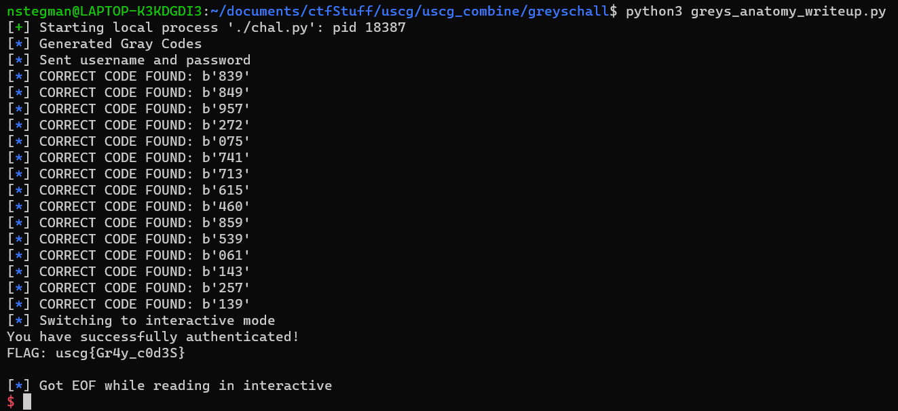

# Season II, US Cyber Games, Open CTF 2022 - Greys Anatomy Writeup
- Type - crypto
- Name - Greys Anatomy
- Points - 484 (21 solves)

## Description
```markdown
Can you compromise the medical records of Seattle Grace Hospital? We've obtained a set of credentials (mgrey/1515) but haven't figured out how to bypass the second factor authentication.

0.cloud.chals.io on:11444

Author: BenderBot
```

## Writeup

Solution script was (mostly) written by TJ OConnor
https://github.com/tj-oconnor/cyber-open-2022/blob/main/crypto/greys/solver.py
https://ctftime.org/writeup/34632 by v10l3nt (https://www.tjoconnor.org/)
Writeup and solution script annotations written by Nick Stegman (@LenceOfTheOrder), 
Writeup reviewed by Justin Applegate (@Legoclones), Chance Harrison (@ChanceHarrison), and John Nguyen (@Magicks52)

### More Problem Description
Upon connecting to the service (via e.g. nc), we get the following:
```
Welcome to the Seattle Grace Hospital EMR Terminal Access Program
Please enter your credentials to access patient records.
Username:
mgrey # using the provided creds
Password:
1515 # using the provided creds

Due to increased security concerns around patient health records, we have recently implemented two-factor authentication.
Please enter the series of 15 3-digit codes found on your 2 factor enabled device.
UPDATE: Due to complaints, we have implemented a custom "trust" meter which will allow you to re-enter a code if you mistype.
Your trust goes down more if it looks like you are randomly guessing.
Enter Code #1 (Trust: 1000): ...
```

### Solution

One (heuristic) way to determine if a submission is an attempt to correct a typo in a previous submission would be to check the Hamming distance between the two words. The Hamming distance between two "code words" is a measure of how "close" they are; in other words, it tells us how many bits of word A need to be flipped to transform it into word B. For example, given two words: A = 34, B = 51, the Hamming distance between them is 2 because we need to flip 2 bits from A == 100010 to get to B == 110011 and vice versa.

Hamming distance is an important concept in coding theory, as it is used in the creation and analysis of error detection and error correction algorithms. To apply this knowledge to abuse the trust that Seattle Grace has given us, we can use another topic from coding theory: Gray Codes. The (Reflected Binary) Gray Code is a sequence of binary strings (or "code words") where each bitstring has a Hamming distance of 1 from the elements immediately preceeding and succeeding it in the sequence. Gray codes are also frequently used in error prevention.

By using the Gray Code sequence, our "trust meter" only goes down by one since the Hamming distance between two successive submissions is always exactly one. This let's use brute force each of the 15 3-digit codes.

<p float="left" align="middle">
  
</p>

**Flag:** `uscg{Gr4y_c0d3S}`