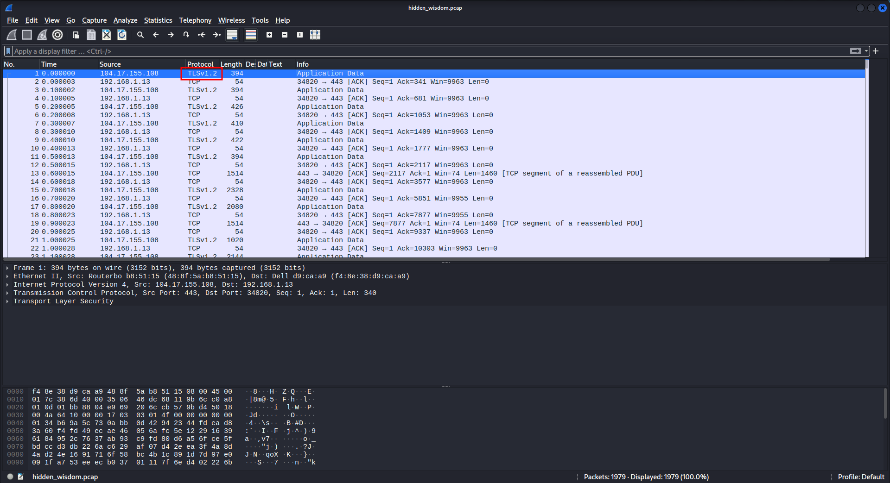
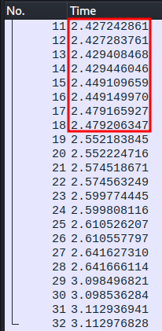
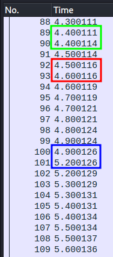

# US Cyber Games, Open CTF 2022 - Hidden Wisdom Writeup
Writeup Author: John Nguyen
- Type - forensics
- Name - Hidden Wisdom
- Points - 500 (5 solves)

## Description
```markdown
I got banned from my favorite video game for hacking, but a friend found a way to send me
a message through the game anyway. Can you help me find his hidden wisdom?

Author: Battelle
```

Attachments: [hidden_wisdom.pcap](./hidden_wisdom.pcap)

## Writeup
### Initial Triage

Upon opening the packet capture provided in the challenge in `wireshark`, we see
a bunch of TLS-encrypted TCP packets that - based on the challenge description -
probably contain game data.



Since a game name wasn't provided, we can assume the solution does not lie in
reversing/decoding the data in the TCP packets. So, the flag must be in another
field. Turns out, the flag can be found by looking at the packet time stamps.

### Anomalies in Packet Time Stamps

A normal packet capture's time stamps would look like the picture on the left
below (taken from my computer). The intervals of time between each packet are fairly
random, and many packets can be sent in under one-tenth of a second, as shown in
the box.

The other picture below shows *this* challenge's time stamps; there is an
unusual consistency in the time stamp intervals of these packets.

<p float="left" align="middle">
  
   
</p>

Further examination reveals that all of these time stamp intervals fall into one of
three values: 1) `~0.000003` seconds (green box), 2) `~0.1` seconds (red box),
3) `~0.3` seconds (blue box).

### Inferring the Meanings of the Time Stamp Intervals

It is abnormal for packets to have repeatedly been sent with intervals longer
than `~0.1` second, so we can assume that the packets sent after an interval of
`~0.000003` second are from the client receiving the message, and not part of the
message itself. That just leaves two more intervals to interpret. What could they be?

Binary data! We can realize that the two different time intervals could represent
binary data, and the fact that there are almost two thousand packets supports this
theory! There seems to be more `~0.1` second intervals than `~0.3` second intervals,
and since there are more `0`s than `1`s in binary ASCII characters, we can assume
that the `~0.1` intervals represent the `0`s, and the `~0.3` intervals represet the
`1`s. If our assumption proves wrong, we can always flip it around and switch the
previously mentioned representations.

### Building the Solve Script

Here is what our script needs to do for every packet:

1. Subtract the time stamp of the previous packet from the current packet to get the 
interval value
2. ONLY if the interval value is roughly `0.1` or `0.3`, append a `0` or a `1`
respectively to the variable storing our binary message

With the steps above in mind, we can write a solve script like this one (adapted
from `https://github.com/tj-oconnor/cyber-open-2022/blob/main/forensics/hiddenwisdom/solve-hidden.py`).

[solve.py](solve.py)

```
$ python3 solve.py
Flag: AskNotForWhomTheFloridaManHacksHeHacksForThee
```

**Flag:** `AskNotForWhomTheFloridaManHacksHeHacksForThee`
